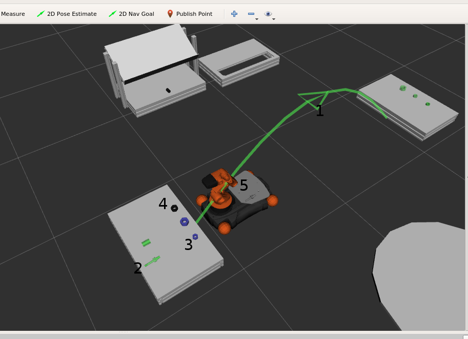

.. _mir_planning_visualisation:

Planning Visualisation
======================

Visualise the planning related knowledge in RViz.

**Knowledge base and plan visualised**

1. ``move_base`` actions according to current plan
2. Unfinished goals (object that needs to be placed) [Green]
3. Objects that need to be picked according to current plan [Blue]
4. Normal objects that need not be interacted with
5. Objects stored on robot's platform

**Knowledge base visualised without plan with fake objects**

.. image:: ../../../mir_planning/mir_planning_visualisation/docs/kb_fake_obj.png

Configuration
-------------

Configuration file for generating a marker from a 3D model is defined as follows

.. literalinclude:: ../../../mir_planning/mir_planning_visualisation/ros/config/model_to_marker.yaml
   :language: yaml
   :lines: 4-17

The marker should be created at the bottom center of the given position. (See
:meth:`mir_planning_visualisation.utils.Utils.get_marker_from_obj_name_and_pos` for more info)

Test
----

.. code-block:: bash

    roscore
    roslaunch mir_planning_core task_planning_components.launch
    roslaunch mir_task_planning upload_problem.launch
    rosrun mir_planner_executor planner_executor_mockup
    roslaunch mir_planning_visualisation test_planning_visualiser.launch
    roslaunch mir_planning_core task_planning_sm.launch
