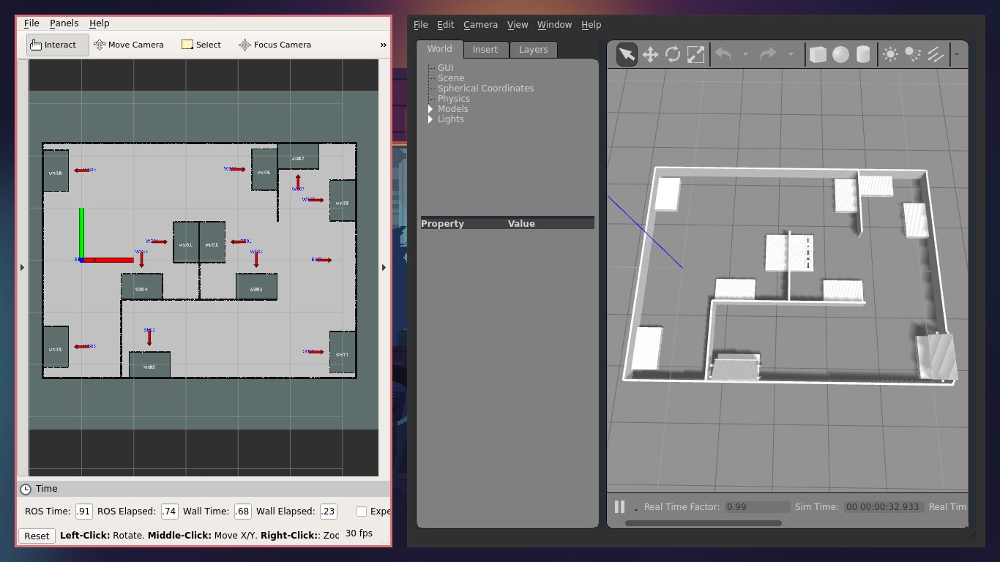
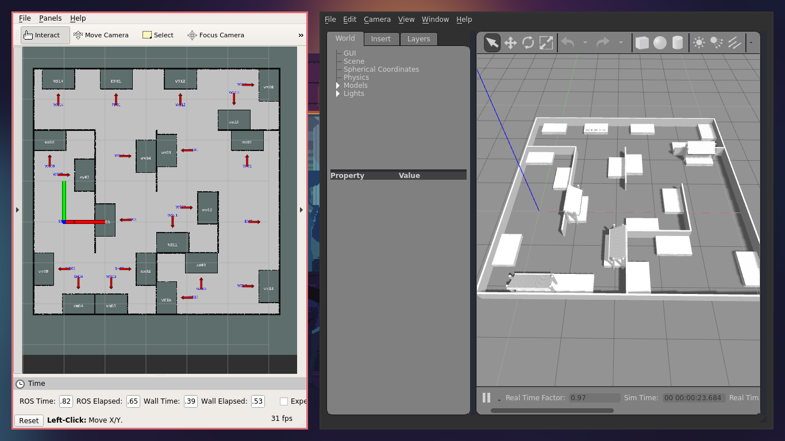

.. _mir_world_generation:

World Generation
================

Procedurally generates at work arena for gazebo simulation.

Generates

- ``.xacro`` file containing world model for gazebo simulator
- ``map.pgm`` and ``map.yaml`` files for occupancy grid for ros navigation
- ``navigation_goals.yaml`` file for industrial robotics :ref:`mir_move_base_safe` action

Change the parameters for generation in ``common/config/config.yaml`` file. (see :ref:`world_generation_config`)

Usage
-----

Generate all necessary files using ``grid_based_generator.py``

.. code-block:: bash

    roscd mir_world_generation/common/mir_world_generation
    python grid_based_generator.py

Visualise all the generated files using example ``.launch`` file

.. code-block:: bash

    roslaunch mir_world_generation sim.launch

.. _world_generation_config:

Configuration
-------------

.. literalinclude:: ../../../mir_simulation/mir_world_generation/common/config/config.yaml
   :language: yaml

Examples
--------

