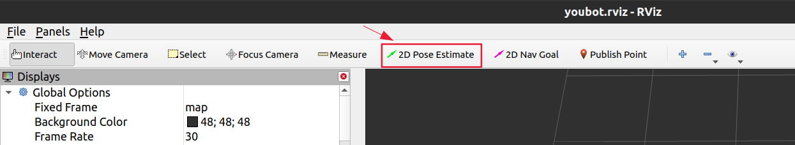

.. code-block:: bash

    Authors: Gokul Krishna Chenchani, Kevin Patel, Shubham Shinde, Vivek Mannava
    Date: 15-Feb-2023

.. _BMT_setup:
BMT (Basic Manipulation Task) setup
======================

.. _required_environments:
Required Environment and setup for YOUBOT
----------------------

* Arena should be mapped (Tutorial for mapping the arena can be found `here <https://b-it-bots.readthedocs.io/en/noetic/mir_navigation/index.html>`_).
* Objects are to be placed on the workstation. 
* Planning PDDL file is to be prepared. 
* A demo ppdl file can be found at ``mas_industrial_robotics/mir_planning/mir_knowledge/common/pddl/general_domain/mini_BMT_demo.pddl``.
  
  * This ppdl assumes that objects S40_40_B, INSULATION_TAPE are placed on WS03.
  * The objects are to be picked from WS03 and placed on WS01.
  * The robot being used is youbot (yb2).

.. _steps_for_BMT:
Steps to follow for BMT setup
----------------------

.. note::

    * Every alias starting with ``t`` will open a shared terminal (tmux).
    * To detatch from the tmux terminal, press ``crtl+a`` and then ``d`` key.

* Switch on the youbot and make sure you are connected to WiFi network ``b-it-bots`` on your computer.

1. Open new terminal (terminal 1) and connect to youbot using below command.
   
.. code-block:: bash

        ssh robocup@192.168.1.114 #this ip is for yb2

* Once your password and fingerprint has been verified, then a connection will be established and you can continue with the following steps.

2. In the terminal (terminal 1) run ``troscore`` command – this will open shared terminal.

.. code-block:: bash

        troscore

        or
        
        tmux new -A -s roscore

3. Now in the same terminal session (terminal 1) run ``roscore`` command.

.. code-block:: bash

        roscore

4. Now open a different terminal (terminal 2) and connect to youbot and then run ``tbringup`` command. 

.. code-block:: bash

        tbringup

        or
        
        tmux new -A -s bringup

5. Once ``tbringup`` is done then in the same terminal session (terminal 2) run ``bringup`` command.

.. code-block:: bash

        bringup
    
        or
    
        roslaunch mir_bringup robot.launch

* Now wait for robot to get initialised - you will see that the arm of the robot is moved into a preconfigured position if it is not in it already and gripper connection is also verified.

6. After initializing is done, open a different terminal (terminal 3) and connect to youbot and then run ``tplanning_bringup`` command.

.. code-block:: bash

        tplanning_bringup
    
        or
    
        tmux new -A -s planning_bringup

7. Now in this terminal session (terminal 3) run ``planning_bringup`` command.

.. code-block:: bash
        
        planning_bringup
        
        or
        
        roslaunch mir_planning_bringup robot.launch

8. Now open new terminal (terminal 4) and connect to youbot and then run ``t2dnav`` command.

.. code-block:: bash

        t2dnav

        or

        tmux new -A -s 2dnav

9. Now in this session (terminal 4) run ``nav2d`` command.

.. code-block:: bash

        nav2d

        or

        roslaunch mir_2dnav 2dnav.launch

* Then place the youbot at the starting position of the arena using joystick.

10. Now Open a new terminal (terminal 5) on local system and run below export command.

.. code-block:: bash

        export ROS_MASTER_URI=http://192.168.1.114:11311 #this ip is for yb2

11. Now in this same terminal (terminal 5) run ``rviz`` command.

.. code-block:: bash

        rviz

* Then in the RVIZ window open the config file named ``youbot.rviz`` (located in ``mas_industrial_robotics`` ROS package).

* Once the file is loaded then localize the youbot using ``2d pose esitimate`` as show in the image below

* Then place the green arrow at location where youbot is actually present in the arena, and rotate the robot till the amcl particles (the tiny red arrows) consolidate. This means the robot is now localized.

12. After the localization is done then open a new terminal (terminal 6) and connect to youbot and then run ``tskynet`` command.

.. code-block:: bash

        tskynet
    
        or
    
        tmux new -A -s skynet

13. Now in the same terminal session (terminal 6) run ``skynet`` command.

.. code-block:: bash

    
        skynet
    
        or
    
        roslaunch mir_planning_core task_planning_sm.launch

14. Now open a new terminal (terminal 7) and connect to youbot and then run ``nightwatch`` command.

.. code-block:: bash

        nightwatch
    
        or
    
        cd .ros; watch cat ~/.ros/task_plan.plan

* The robot will now execute the actions as required by the ppdl file. 

* Once all the tasks completed then kill every node in the terminals one after the other in reverse order.

