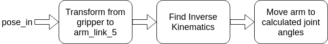

# mir_moveit_to_pose
This ros package accepts a `geometry_msgs/PoseStamped` msg and tries to move 
manipulator arm in such a way that the gripper tip is aligned with it.

It uses inverse kinematics to find the joint angles and uses moveit to achieve
these joint angles.

## Dependencies
- `mcr_manipulation_utils_ros`
- `moveit_commander`

## Usage
*Launch code (without planning_bringup)*
- `roslaunch mir_moveit_to_pose test.launch`

*Launch code (with planning_bringup)*
- `roslaunch mir_moveit_to_pose moveit_to_pose.launch`

*Send pose*
- `rostopic pub /moveit_to_pose/pose_in (TAB COMPLETE AND FILL MESSAGE)` 

*Receive feedback*
- `rostopic echo /moveit_to_pose/event_out`

*Send trigger*
- `rostopic pub /moveit_to_pose/event_in std_msgs/String "data: 'e_trigger'"`
