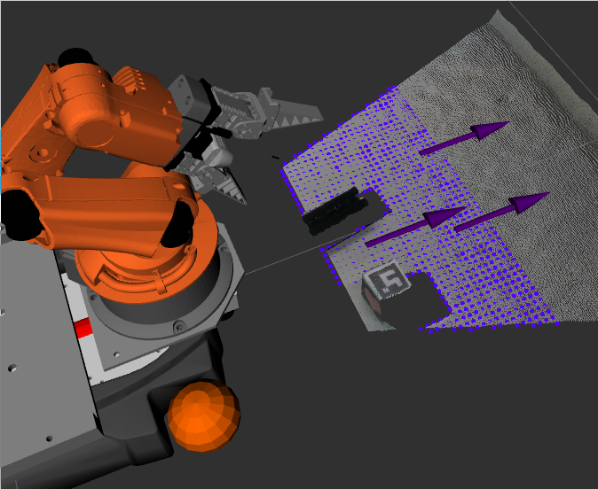
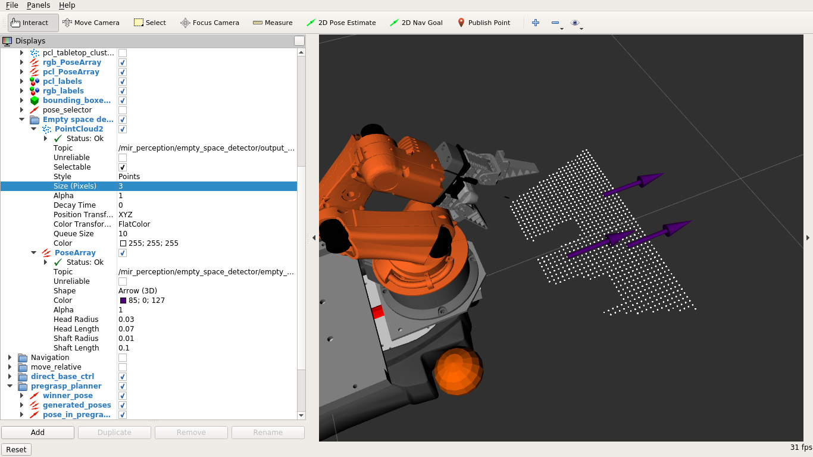

# mir_empty_space_detection

Detects empty space on a workstation using point cloud library.



Given a point cloud, it tries to find a plane after removing all outliers. If
there are any objects on this plane, those become holes. From this plane, empty
spaces are extracted using sampling. An empty space is defined by a circle with
some pre-defined radius (ros parameter). A sample is considered a valid empty
space if a certain percentage (ros parameter) of expected number of points are
present in its circle.

## Usage

- Launch the perceiver with
  ```
  roslaunch mir_empty_space_detection empty_space_detector.launch
  ```

- See the response with
  ```
  rostopic echo /mir_perception/empty_space_detector/event_out
  ```

- Add cloud with
  ```
  rostopic pub /mir_perception/empty_space_detector/event_in std_msgs/String "data: 'e_add_cloud'" -1
  ```

- Trigger the detection with
  ```
  rostopic pub /mir_perception/empty_space_detector/event_in std_msgs/String "data: 'e_trigger'" -1
  ```

## Topics

### In
- `/mir_perception/empty_space_detector/event_in`
- `/mir_perception/empty_space_detector/input_point_cloud` -> `/arm_cam3d/depth_registered/points`

### Out
- `/mir_perception/empty_space_detector/empty_spaces`
- `/mir_perception/empty_space_detector/event_out`
- `/mir_perception/empty_space_detector/output_point_cloud` (debug)

Debug can be visualised in RViz as follows


