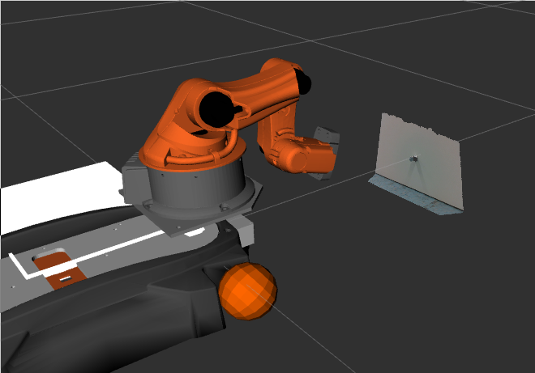
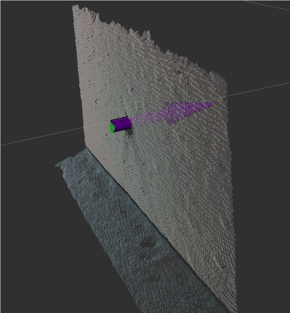

# mir_handle_detection

Detects drawer handle using point cloud library.

This is what robot sees



This is the pose of the handle



## Usage

- Launch the perceiver with
  ```
  roslaunch mir_handle_detection drawer_handle_perceiver.launch
  ```

- See the response with
  ```
  rostopic echo /mir_perception/drawer_handle_perceiver/event_out
  ```

- Trigger the detection with
  ```
  rostopic pub /mir_perception/drawer_handle_perceiver/event_in std_msgs/String "data: 'e_start'" -1
  ```

## Topics

### In
- `/mir_perception/drawer_handle_perceiver/event_in`
- `/mir_perception/drawer_handle_perceiver/input_point_cloud` -> `/arm_cam3d/depth_registered/points`

### Out
- `/mir_perception/drawer_handle_perceiver/output_pose`
- `/mir_perception/drawer_handle_perceiver/event_out`
- `/mir_perception/drawer_handle_perceiver/output_point_cloud`
