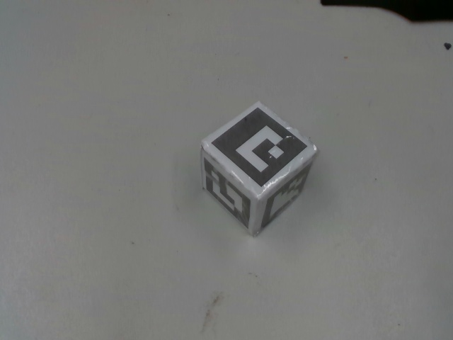

# mir_perceive_aruco_cube

Detects aruco cube and publishes its pose.



This package is meant to be used as mock perceive instead of real perceive. This
might help in integrating the rest of the pipeline (pick, place, etc) when actual
perception is not yet ready.

It can be used for **one shot perception** where it publishes a pose and an object
list as well as for **continuous perception** (needed for closed loop pick) where it
publishes a pose continously.

Related package: `mir\_perceive\_mock`

Input: 
 - raw image (`/arm_cam3d/rgb/image_raw`) 
 - camera info (`/arm_cam3d/rgb/camera_info`)
 - event in (`/mir_perception/aruco_cube_perceiver/event_in`)
Output: 
 - event out (`/mir_perception/aruco_cube_perceiver/event_out`)
 - output pose (`/mir_perception/aruco_cube_perceiver/object_pose`)
 - output object list (`/mcr_perception/object_list_merger/output_object_list`)

### Events:

- **One shot**: 
  - event in: `e_trigger`
  - event out: `e_success` or `e_failure`
- **Continous**:
  - event in: `e_start` or `e_stop`
  - event out: `e_started` or `e_stopped`

## Test

- **Without action server**
  Start bringup and move the arm such that the camera is looking at aruco cube
  ```
  roslaunch mir_perceive_aruco_cube perceive_aruco_cube.launch
  rostopic echo /mir_perception/aruco_cube_perceiver/object_pose
  rostopic echo /mir_perception/aruco_cube_perceive/event_out
  rostopic pub /mir_perception/aruco_cube_perceiver/event_in std_msgs/String "data: 'e_trigger'" -1
  ```
  or with continous perceiving
  ```
  roslaunch mir_perceive_aruco_cube perceive_aruco_cube.launch
  rostopic echo /mir_perception/aruco_cube_perceiver/object_pose
  rostopic echo /mir_perception/aruco_cube_perceive/event_out
  rostopic pub /mir_perception/aruco_cube_perceiver/event_in std_msgs/String "data: 'e_start'" -1
  rostopic pub /mir_perception/aruco_cube_perceiver/event_in std_msgs/String "data: 'e_stop'" -1
  ```

- **With action server**
  Please see `mir\_perceive\_mock`

  After successfully perceiving an aruco cube, to pick it
  ```
  rosrun mir_pick_object pick_object_client_test.py ARUCO_CUBE
  ```


