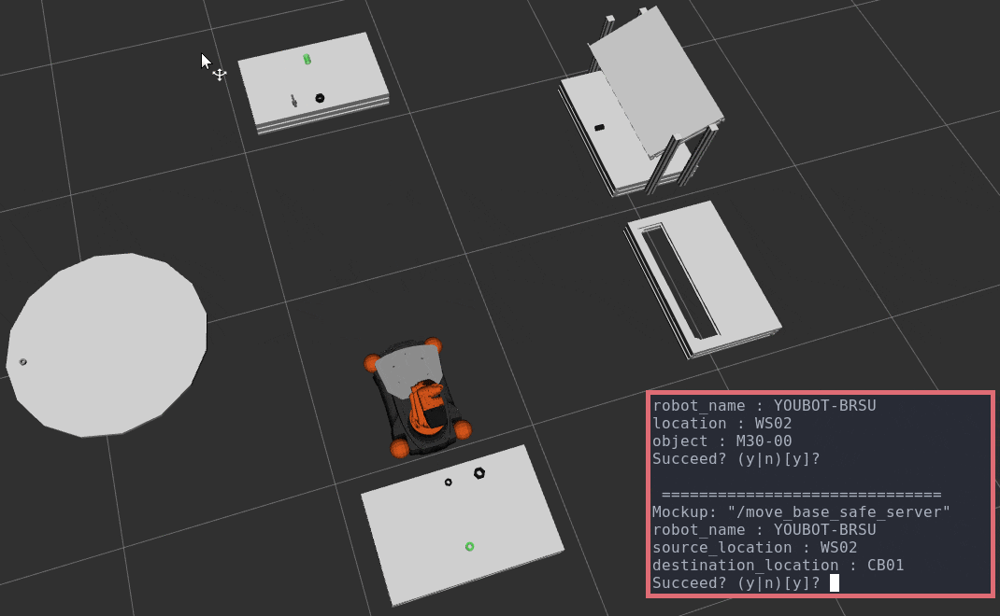

# mir_planning



## Test

```
roscore
roslaunch mir_planning_core task_planning_components.launch
roslaunch mir_task_planning upload_problem.launch
rosrun mir_planner_executor planner_executor_mockup
roslaunch mir_planning_visualisation test_planning_visualiser.launch
roslaunch mir_planning_core task_planning_sm.launch
```
