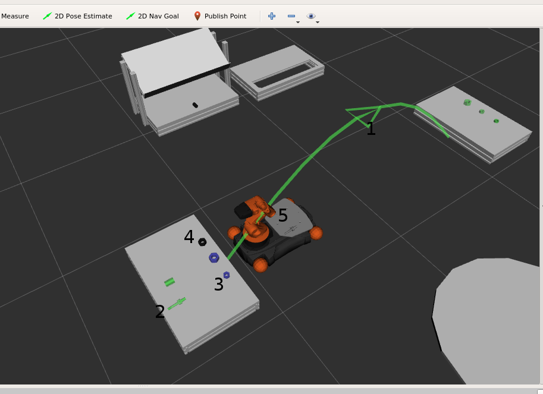
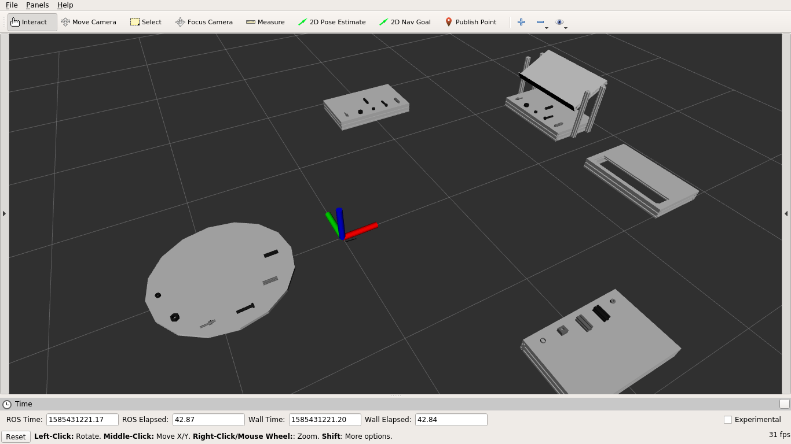

# mir_planning_visualisation

Visualise the planning related knowledge in RViz.

**Knowledge base and plan visualised**

1. `move_base` actions according to current plan
2. Unfinished goals (object that needs to be placed) [Green]
3. Objects that need to be picked according to current plan [Blue]
4. Normal objects that need not be interacted with
5. Objects stored on robot's platform

**Knowledge base visualised without plan with fake objects**



## Test

```
roscore
roslaunch mir_planning_core task_planning_components.launch
roslaunch mir_task_planning upload_problem.launch
rosrun mir_planner_executor planner_executor_mockup
roslaunch mir_planning_visualisation test_planning_visualiser.launch
roslaunch mir_planning_core task_planning_sm.launch
```


